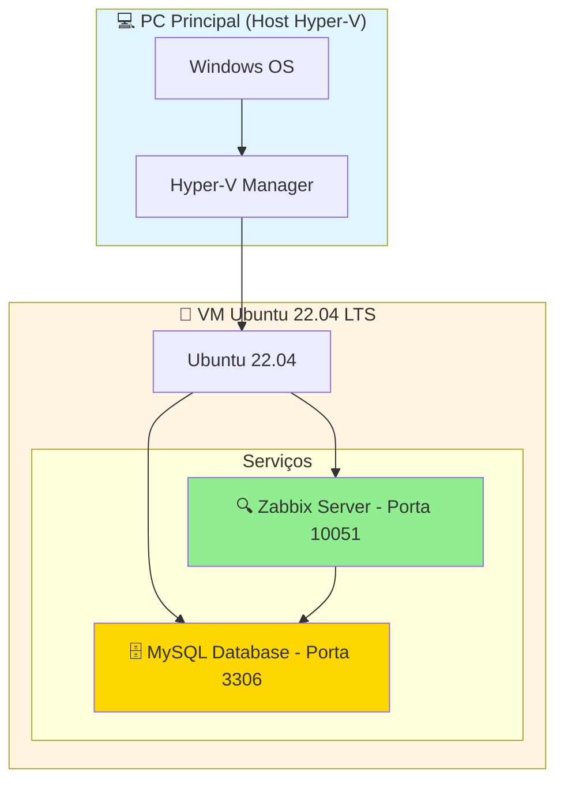

# 🖥️ Saud Homelab — Monitoramento com Zabbix

> Ambiente pessoal de infraestrutura com foco em monitoramento, documentação e aprendizado de novas tecnologias.

---

## 🎯 Sobre o Projeto

**Saud Homelab** é um homelab criado por **Gustavo Saud** para estudo e prática de ferramentas de T.I., com ênfase em:

- 🔍 **Monitoramento** com Zabbix
- 🐧 **Virtualização** com Hyper-V + Ubuntu Server
- 📬 **Alertas** via Telegram
- 📚 **Documentação** de infraestrutura

---

## 🖥️ Topologia do Ambiente



| Componente        | Sistema Operacional   | Função                     |
|-------------------|-----------------------|----------------------------|
| PC Principal      | Windows (Hyper-V)     | Host da virtualização      |
| VM Ubuntu 22.04   | Ubuntu Server 22.04   | Zabbix Server + MySQL      |

---

## 📁 Estrutura do Repositório

```
saud-homelab/
├── README.md                          # Este arquivo
├── .gitignore
├── docs/
│   ├── 00-introducao.md               # Visão geral do ambiente
│   ├── 01-topologia.md                # Diagrama e componentes
│   └── 03_01-zabbix-telegram.md       # Guia: alertas via Telegram
├── scripts/
│   └── telegram_notification.py      # Script de notificação Telegram
└── configs/
    └── zabbix_agentd.conf.example     # Exemplo de config do agente
```

---

## 🚀 Guias Disponíveis

| Guia | Descrição |
|------|-----------|
| [Introdução ao Ambiente](docs/00-introducao.md) | Visão geral do Cloud Saud |
| [Topologia](docs/01-topologia.md) | Diagrama e componentes do lab |
| [Zabbix + Telegram](docs/03_01-zabbix-telegram.md) | Configurar alertas via Telegram com suporte a múltiplos usuários e host groups |

---

## 🛠️ Stack Utilizada


---

## ⚙️ Como Reproduzir Este Lab

### Pré-requisitos

- Windows com Hyper-V habilitado
- ISO do Ubuntu Server 22.04
- Conta no Telegram (para alertas)

### Setup Rápido

```bash
# 1. Instalar Zabbix Server (Ubuntu 22.04)
wget https://repo.zabbix.com/zabbix/7.0/ubuntu/pool/main/z/zabbix-release/zabbix-release_latest+ubuntu22.04_all.deb
sudo dpkg -i zabbix-release_latest+ubuntu22.04_all.deb
sudo apt update
sudo apt install zabbix-server-mysql zabbix-frontend-php zabbix-apache-conf zabbix-sql-scripts zabbix-agent

# 2. Configurar alertas Telegram
# Veja: docs/03_01-zabbix-telegram.md
```

---

## 🔐 Segurança

- **Nunca** suba tokens do Telegram, senhas ou API keys no repositório
- Use variáveis de ambiente ou arquivos `.env` (já no `.gitignore`)
- IPs internos são da rede local e não expõem risco externo

---

## 📌 Roadmap

- [x] Zabbix Server funcionando
- [x] Monitoramento do PC principal
- [x] Alertas via Telegram
- [ ] Dashboard customizado no Zabbix
- [ ] Templates exportados (.yaml)
- [ ] Monitoramento de containers Docker

---

## 👤 Autor

**Gustavo Saud**  
🔗 https://github.com/robacenadev

---

> ⚠️ Este é um ambiente de laboratório pessoal. As configurações aqui presentes são para fins educacionais.
