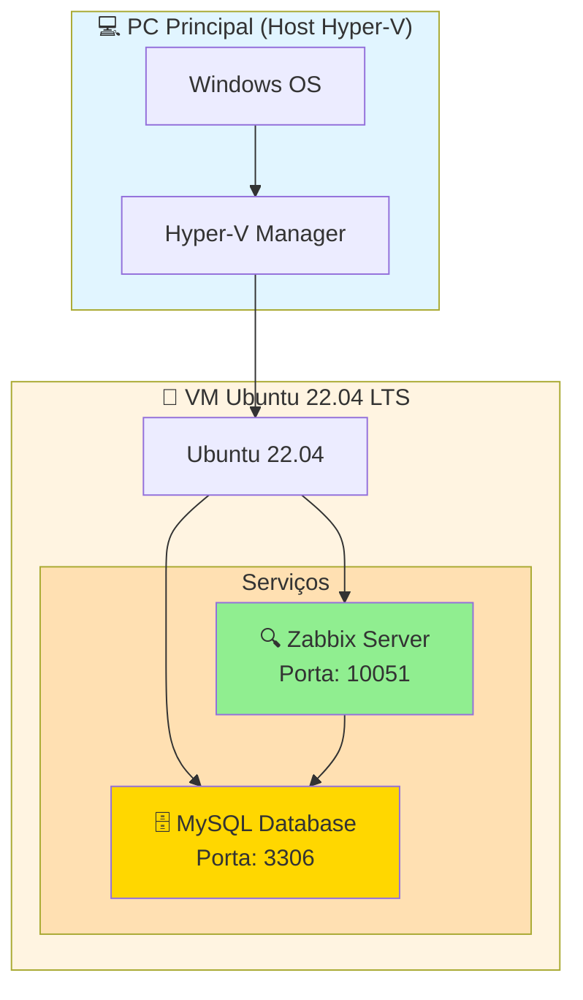

# 🖥️ Topologia do Ambiente

Visualização da infraestrutura do ambiente Saud Homelab.

---

## 🗺️ Diagrama de Topologia



---

## 🌐 Endereços de Acesso

| Serviço       | IP (exemplo)   | Porta |
|---------------|----------------|-------|
| Zabbix Web    | 192.168.x.110  | 80    |
| Zabbix Server | 192.168.x.110  | 10051 |
| MySQL         | 192.168.x.110  | 3306  |

> 💡 Substitua `192.168.x.110` pelo IP real da sua VM na sua rede local.

---

## 💻 Componentes

### PC Principal (Host)
- **OS:** Windows com Hyper-V habilitado
- **Função:** Hospedar a VM do Zabbix
- **Ferramenta de doc:** Obsidian

### VM Linux
- **OS:** Ubuntu Server 22.04 LTS
- **Serviços:**
  - **Zabbix Server** — Coleta e processa os dados de monitoramento
  - **MySQL** — Armazena o histórico e configurações do Zabbix

---

## 🔗 Fluxo de Comunicação

```
Hosts monitorados → Zabbix Agent (10050)
                  → Zabbix Server (10051)
                  → MySQL (3306)
```

---

**Versão:** 2.0  
**Última atualização:** 2025-11-15
